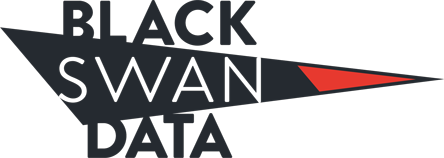

# Black-Swan-group-workshop

# HOW IT WORKS
Nothing has the impact of actual photo or video footage of an event. It is said pictures never lie. We make sure that rings true. One valuable service we provide is the “cleaning up” of visual and audio files.

We eliminate the back ground noise and bring the truth to light. Our mobile forensics team of experts maintain the integrity of the data while providing it in a form that can be easily viewed, heard and understood.

All of this information is related to you in a manner you can easily utilize. You and your staff will not have to spend countless hours and days evaluating the data. You will know every detail related to your data and have it available to you in a convenient format.

In addition to the computer itself, we are able to access any and all cloud storage. The volume of the raw data can be overwhelming, but we provide you with the information in a readily consumable format.

Black Swan – computer forensics specialist provides you with the data mined in a wide array of formats of your choosing. We can produce charts, graphs and other visual presentations to help you and/or a jury understand what the data means.

#praneeth will be demostrating Real-Time capture and processing software.

#Noah will be demostrating Image and video processing and Photogrammetry.
